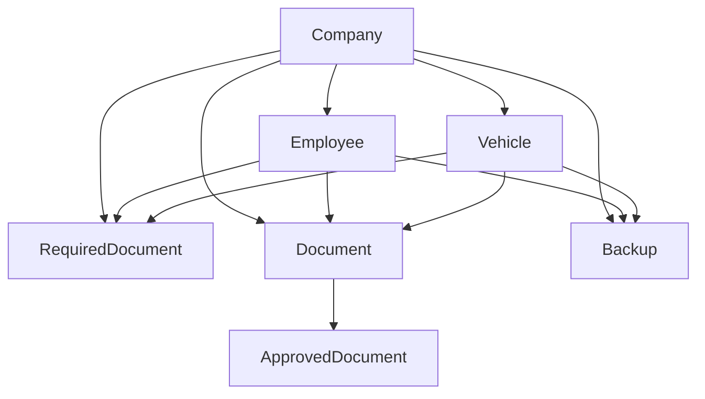

# Entities

This file documents two layers:

1. the actual SDK storage entities exposed today
2. the common business entities used by external ControlFile integrations

The current standalone SDK directly exposes storage entities such as `File`, `Folder`, `Share`, and `UserProfile`.

Business entities such as `Company` and `Vehicle` are common in integrations, but they are not first-class SDK modules in the current package. External apps usually model them in their own backend and store related documents through this SDK.

## SDK storage entities

### File

Description:
Binary object stored in ControlFile.

Fields:

- `id: string`
- `userId: string`
- `name: string`
- `size: number`
- `mime: string`
- `type: 'file'`
- `parentId: string | null`
- `appId?: string`
- `bucketKey?: string`
- `createdAt: string | Date`
- `updatedAt: string | Date`
- `deletedAt?: string | Date | null`

Relationships:

- belongs to one folder through `parentId`
- can have many share links

### Folder

Description:
Hierarchical container for files and subfolders.

Fields:

- `id: string`
- `userId: string`
- `name: string`
- `type: 'folder'`
- `parentId: string | null`
- `appId?: string`
- `icon?: string`
- `color?: string`
- `createdAt: string | Date`
- `updatedAt: string | Date`
- `deletedAt?: string | Date | null`

Relationships:

- may contain many files
- may contain many folders

### Share

Description:
Public access link for a file.

Fields:

- `token: string`
- `fileId: string`
- `fileName: string`
- `fileSize: number`
- `mime: string`
- `expiresAt: string | Date | null`
- `createdAt: string | Date`
- `downloadCount: number`
- `shareUrl: string`

Relationships:

- belongs to one file

### UserProfile

Description:
Authenticated user record returned by user profile methods.

Fields:

- `uid: string`
- `email?: string`
- `displayName?: string`
- `photoURL?: string`
- `username?: string`
- `planQuotaBytes?: number`
- `usedBytes?: number`
- `pendingBytes?: number`
- `createdAt?: string | Date`
- `updatedAt?: string | Date`
- `metadata?: UserProfileMetadata`

Relationships:

- owns files and folders
- owns settings and taskbar state

## Common integration entities

These are conceptual business entities commonly used by ControlFile ecosystem apps. They are not currently implemented as first-class SDK modules.

### Company

Description:
Top-level organization record for a customer or tenant.

Fields:

- `id`
- `name`
- `createdAt`
- `employees`
- `vehicles`
- `documents`

Relationships:

- has many employees
- has many vehicles
- has many required documents
- has many uploaded documents

### Employee

Description:
Person associated with a company.

Fields:

- `id`
- `companyId`
- `name`
- `email`
- `role`
- `createdAt`

Relationships:

- belongs to one company
- may have many required documents
- may have many approved documents

### Vehicle

Description:
Managed vehicle associated with a company.

Fields:

- `id`
- `companyId`
- `plate`
- `type`
- `status`
- `createdAt`

Relationships:

- belongs to one company
- may have many required documents
- may have many approved documents

### Document

Description:
Generic uploaded file linked to a business record.

Fields:

- `id`
- `ownerType`
- `ownerId`
- `fileId`
- `name`
- `mime`
- `uploadedAt`

Relationships:

- belongs to a company, employee, or vehicle
- may become an approved document

### ApprovedDocument

Description:
Document that has passed review or validation.

Fields:

- `id`
- `documentId`
- `approvedBy`
- `approvedAt`
- `status`

Relationships:

- belongs to one document

### RequiredDocument

Description:
Document rule that defines what must exist for a company, employee, or vehicle.

Fields:

- `id`
- `ownerType`
- `ownerId`
- `name`
- `required`
- `expires`

Relationships:

- belongs to a company, employee, or vehicle
- may be satisfied by one or more uploaded documents

### Backup

Description:
Export or snapshot of selected records and files.

Fields:

- `id`
- `scope`
- `createdAt`
- `status`
- `downloadUrl`

Relationships:

- may include companies
- may include employees
- may include vehicles
- may include documents

## Relationship diagram

## Suggested mapping for current SDK

Typical mapping when using the current SDK:

- `Company` -> folder or external backend record
- `Employee` -> folder, metadata file, or external backend record
- `Vehicle` -> folder, metadata file, or external backend record
- `Document` -> `File`
- `ApprovedDocument` -> file plus approval metadata in your backend
- `RequiredDocument` -> metadata/config in your backend
- `Backup` -> generated file bundle stored as `File`
